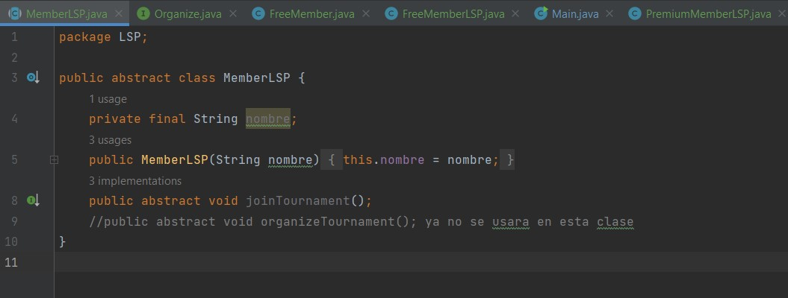
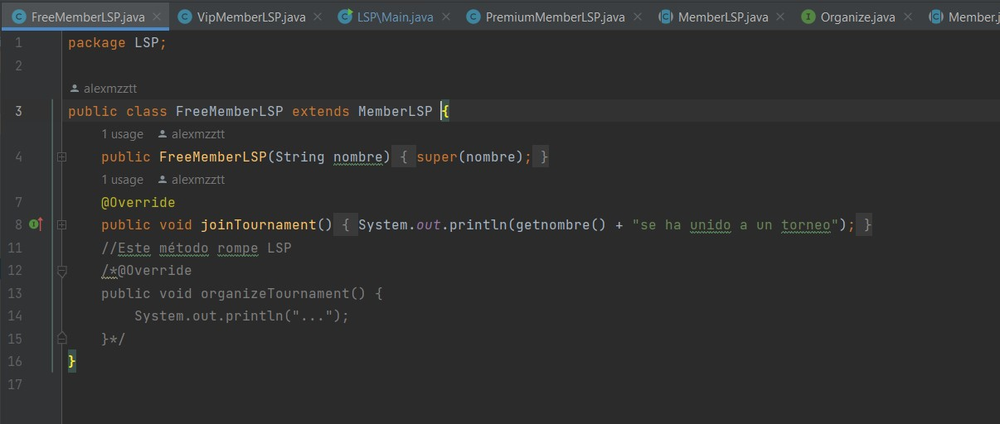
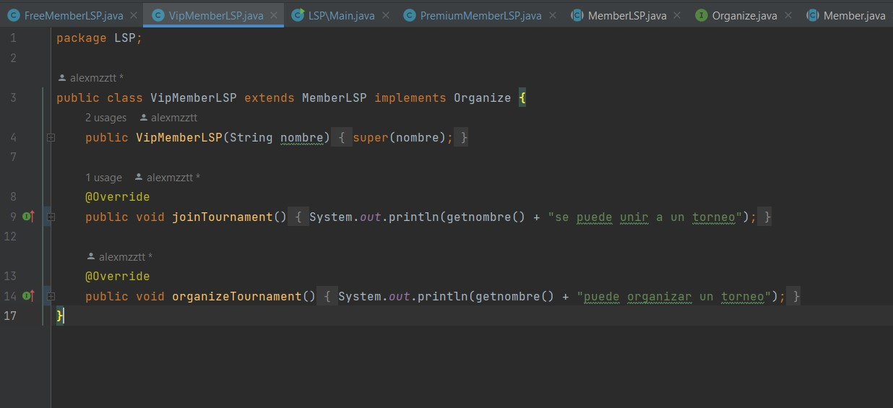

# Pregunta 1

##SOLID y refactorización

Primero tenemos la clase Member es abstracta y representa la clase base para todos los miembros del club de
ajedrez:

Luego la clase PremiumMember puede unirse a torneos de ajedrez u organizar tales torneos
también. Entonces, su implementación es bastante simple:

Tambien tenemos la clase VipMember que nos mencionan que es mas o menos la misma que PremiumMember:

Y clase FreeMember. La clase FreeMember puede unirse a torneos, pero no puede organizar torneos:

Por ultimo nos pide consultar la siguiente lista de miembros, vamos al main:

Sabemos que tenemos un problema con la clase FreeMember, ya que esta no puede organizar torneos, entonces rompe LSP ya que no puede definir "organizeTournament".

Ahora pasamos a refactorizar:

Como todas heredan de la clase Member entonces tenemos el error en FreeMember ya que si bien puede unirse a torneos,
no los puede organizar, una de las formas más rapidas sería extraer el metodo organizeTournament

Si cambiamos organizeTournament a una clase, nos saldra un error y una recomendacion que extraerlo a interfaz:

Entonces extraemos o creamos una interfaz Organize la cual implementaremos en las clases que puedan organizar torneos 
como PremiumMember y VipMember, asi ya no habria problemas con FreeMember, ya que ahi no implementaremos la interfaz y solamente lo dejaremos con el extends Member que ya no tiene implementado el metodo de organizeTournament:

Interfaz Organize:

Clase MembersLSP:

Clase FreeMemberLSP:

Clase PremiumMemberLSP:

Clase VipMemberLSP:

