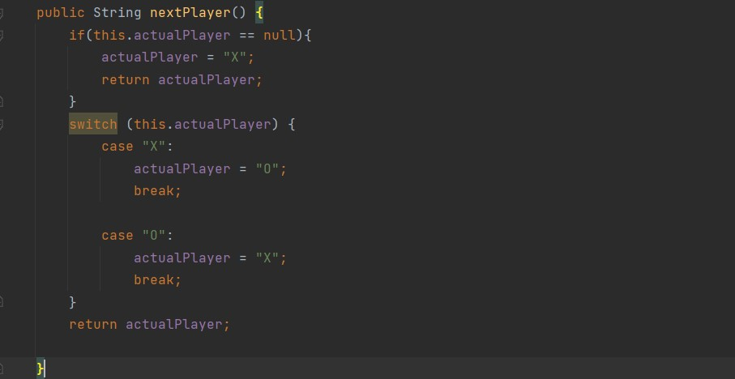

# Pregunta 2

## Prueba: límites deltablero I y II

Escribe la prueba para comprobar si una pieza está colocada dentro de los límites del 3x3.
Cuando una pieza se coloca en cualquier lugar fuera del eje x, se lanza RuntimeException. En
esta prueba, estamos definiendo que se espera RuntimeException cuando se invoca el método
ticTacToe.jugar(5, 2).
Todo lo que tenemos que hacer es crear el método jugar y asegurarnos de que arroja
RuntimeException cuando el argumento x es menor que 1 o mayor que 3 (el tablero es 3x3).
Debes ejecutar esta prueba tres veces. La primera vez, debería fallar porque el método jugar
no existe. Una vez que se agrega, debería fallar porque no se lanza RuntimeException. La
tercera vez, debería tener éxito porque el código que corresponde a esta prueba está
completamente implementado.

Haciendo la primera prueba, como vemos falla ya que el metodo play no existe:

Ahora haremos la segunda prueba, vemos que falla porque aun no esta la implementacion:

Ahora en la tercera prueba implementamos play:

##Prueba - lugar ocupado

Ahora que sabemos que las piezas se colocan dentro de los límites del tablero, debemos
asegurarnos de que solo se puedan colocar en espacios desocupados. Escribe una prueba para
este caso.

Primero mostraremos cuando falla:

Ahora añadiremos el código y ejecutaremos la prueba para que el test pase:

##Refactorizacion

Refactorizamos el metodo play:

###Requisito 2: agregar soporte para dos jugadores

Ahora es el momento de trabajar en la especificación de qué jugador está a punto de jugar su
turno.

Debería haber una manera de averiguar qué jugador debería jugar a continuación

Podemos dividir este requisito en tres pruebas:

- El primer turno lo debe jugar el jugador X

- Si el último turno fue jugado por X, entonces el próximo turno debe ser jugado por O

- Si el último turno fue jugado por O, entonces el próximo turno debe ser jugado por X

Prueba – X juega primero:

Ahora hacemos que la prueba pase:

Prueba: O juego justo después de X

Escribe la prueba para asegurarte de que los jugadores estén cambiando. Después de que X
haya terminado, debería ser el turno de O, luego nuevamente X, y así sucesivamente.
Si el último turno fue jugado por X, entonces el próximo turno debe ser jugado por O.

Primero hacemos que la prueba falle:

Luego hacemos que pase:

Prueba: X juega justo después de O

Primero hacemos que falle:

Ahora hacemos que pase:

###Requisito 3: agregar condiciones ganadoras

Un jugador gana al ser el primero en conectar una línea de piezas amigas de un lado o esquina
del tablero al otro.
Para verificar si una línea de piezas amigas está conectada, debemos verificar las líneas
horizontales, verticales y diagonales.

- Prueba: por defecto no hay ganador

Comencemos definiendo la respuesta predeterminada del método jugar: Si no se cumple
ninguna condición ganadora, entonces no hay ganador. Realiza esta prueba.

- Prueba – condición ganadora I

El jugador gana cuando toda la línea horizontal está ocupada por sus piezas. Realiza esta
prueba. Para cumplir con esta prueba, debemos verificar si alguna línea horizontal está llena con la
misma marca que el jugador actual. Hasta este momento, no nos importaba lo que se pusiera en
el arreglo del tablero.
Ahora, necesitamos introducir no solo qué casillas del tablero están vacías, sino también qué
jugador las jugó. Realiza la implementación.

Ahora haremos que pase la prueba:

- Prueba – condición ganadora II

Ahora haremos que pase la prueba:

Prueba – condición ganadora III

Refactorizado

Ahora haremos que pase:

###Requisito 4: condiciones de empate

Refactorizado

Lo único que falta es cómo abordar el resultado del empate. El resultado es un empate cuando
se llenan todas las casillas.

Ahora haremos que pase la prueba:

Covergae con jacoco:

