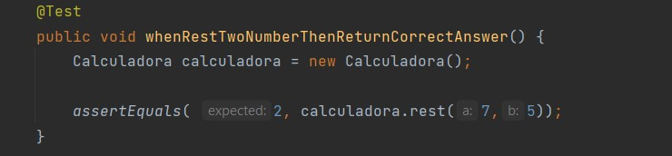

# Actividad Refactorizacion

## Requisito 1: 

El estado de la calculadora es verdadero cuando se inicializa correctamente.

Primero escribimos la prueba en la clase CalculatorTest

Luego escribimos el código que la hace verdadera

Ejecutamos la prueba para verificar que todo está bien:

## Requisito 2:

La calculadora debe tener funciones de suma y resta.

Hacemos la primera refactorización. Usaremos la anotación @BeforeAll para escribir un método que se ejecutará primero antes del método de prueba.

Ahora podemos eliminar todo el código de inicialización de la calculadora en los métodos de prueba

Realizamos la implementaciónb de la función de resta:

Verificamos si pasan las pruebas:

## Requisito 3:

La calculadora debe tener función de división.

Cuando alguien divide por cero, se debe lanzar una excepción. Escribamos la primera prueba para este requisito.

Implementación

Debemos comprobar que se lanza una excepción cuando alguien divide por cero:

Verificamos que pase la prueba:

## Ejercicio: 

Agrega más funciones a la clase Calculadora utilizando los principios de TDD.

Agregaremos multipllicación

Verificamos que pase la prueba:

